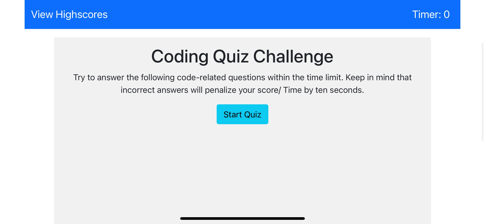
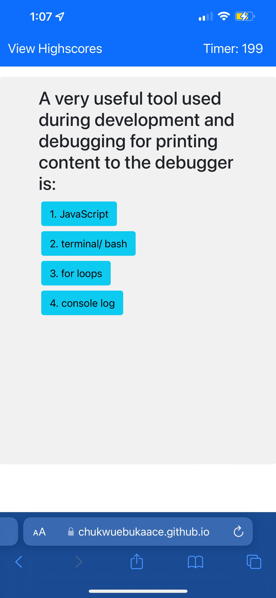
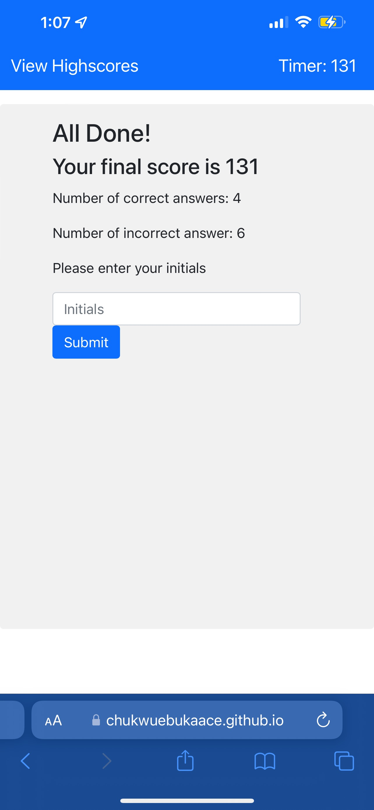

# code-quiz-game

An HTML-based coding quiz game, dynamically updated and tracked using DOM manipulation and local storage

## Description

The application is an HTML-based coding quiz game. The content is dynamically generated to a single page using JavaScript and DOM manipulation. Styling is mostly applied though Bootstrap CSS framework styling classes. User scores are stored locally using the localStorage web API object.

### Features

Ten coding-related multiple choice questions
Questions are displayed in a random order
Buttons allow the user to select an answer
Text prompts in the browser window which the user if the selected answer was correct of incorrect
Countdown timer tracks the user time/ score
Penalty system subtracts 10 seconds from the user score if an incorrect answer is selected
Results page displays the user scores and allows the user to submit their first name or initials for a high score list
A high score page displays a list of the user's high scores in descending order, and allows the users to clear the scores from the page and localStorage
Installation

Upload index.html, highscores.html, license.txt, and assets folder to the deployed webserver. Assets folder contains JavaScript and CSS files.

The application shown below was deployed using GitHub Pages. The repository can be replicated by via fork, clone, and redeployment with GitHub Pages.
link to REPO https://github.com/chukwuebukaace/Code-Quiz/tree/master

#### Usage

Link to deployed instance of the application: https://chukwuebukaace.github.io/Code-Quiz/ 

The application has clickable buttons to start and progress through the quiz. All content is generated dynamically on the index.html page, with the exception of user high scores which can be viewed and cleared on a separate page.

